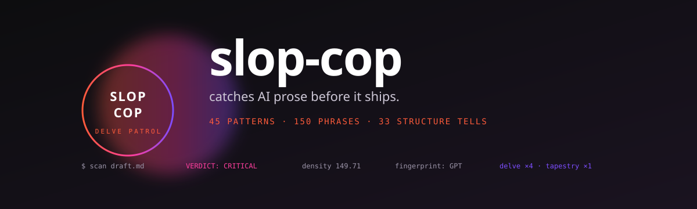

<p align="center">
  
</p>

<p align="center">
  <a href="https://github.com/MahmoudHalat/slop-cop/releases/latest"></a>
  <a href="https://github.com/MahmoudHalat/slop-cop/blob/main/LICENSE"></a>
  <a href="#install"></a>
  <a href="#sources"></a>
  <a href="#what-it-catches"></a>
</p>

---

**slop-cop** is a Claude Code skill that scans prose on two parallel axes and tells you what's wrong on each.

- **AI-Slop axis** — Does this read like AI wrote it? Patterns, vocabulary, formatting, rhythm.
- **Comprehension axis** — Can a fresh reader follow this? Acronyms, named-entity bombing, telegraphic compression, readability, structure.

A piece can pass one axis and fail the other. A polished marketing post might score PASS on AI-slop but CRITICAL on comprehension because it stuffs nine acronyms into a 200-word paragraph. A chatty Slack message might fail AI-slop on `delve` and em dashes but read just fine. The two axes catch different problems and the report shows both side by side.

Hand it a draft, get back two verdicts, two density scores, the exact things to cut on each axis, a model fingerprint when one is detectable, and a single combined recommendation pulled from whichever axis is worse.

The scoring is density-based on both axes, which means a single `delve` or one undefined acronym in 1,000 words won't trip the verdict. Concentration per unit of text is the signal that matters. This README scores LOW on its own scanner.

## Sponsors

<a href="https://givefeedback.dev"></a>GiveFeedback.dev uses AI to turn client screen recordings into actionable tasks and prevent scope creep.

## Install

One command. The skill goes into your Claude Code skills directory and triggers on phrases like *"is this AI"*, *"is this readable"*, *"audit this draft"*, *"humanize this"*, *"slop check"*, *"comprehension check"*.

```bash
curl -L https://github.com/MahmoudHalat/slop-cop/releases/latest/download/ai-slop-detector.skill -o /tmp/slop-cop.zip \
  && unzip -o /tmp/slop-cop.zip -d ~/.claude/skills/ \
  && rm /tmp/slop-cop.zip
```

That installs the bundle as `~/.claude/skills/ai-slop-detector/`. Restart Claude Code and the skill auto-loads.

Prefer git? Clone straight in:

```bash
git clone https://github.com/MahmoudHalat/slop-cop.git ~/.claude/skills/ai-slop-detector
```

## Use

In Claude Code, just talk to it:

```
audit this draft for AI tells
is this AI?
is this readable?
humanize this
slop-check
de-slop this paragraph
comprehension check
would a fresh reader follow this?
```

Or run the scanner directly:

```bash
python3 ~/.claude/skills/ai-slop-detector/scripts/scan.py path/to/draft.md
python3 ~/.claude/skills/ai-slop-detector/scripts/scan.py --quick draft.md
python3 ~/.claude/skills/ai-slop-detector/scripts/scan.py --json draft.md
python3 ~/.claude/skills/ai-slop-detector/scripts/scan.py --genre academic draft.md
python3 ~/.claude/skills/ai-slop-detector/scripts/scan.py --audience marketing draft.md
python3 ~/.claude/skills/ai-slop-detector/scripts/scan.py --strict-em-dash draft.md
echo "your draft text" | python3 ~/.claude/skills/ai-slop-detector/scripts/scan.py
```

## Sample output

Three real runs from the smoke-test fixtures. Notice how each axis catches different things:

| Sample | AI-Slop | Comprehension | Combined recommendation |
|---|---|---|---|
| Hand-written cover letter (no LLM touch) | **PASS** (1.5) | **PASS** (1.8) | Ship it |
| Dense expert TL;DR (named-entity bomb) | **HIGH** (13.0) | **CRITICAL** (30.0) | Full rewrite |
| Chatty B2B letter (real human, dense) | **LOW** (2.5) | **CRITICAL** (31.0) | Comprehension rewrite — texture is fine but the reader can't follow |
| Synthetic AI marketing post | **CRITICAL** (150.9) | **CRITICAL** (22.1) | Full rewrite |

The third row is the case that drove v2. The text reads like a thoughtful human wrote it (low AI-slop), but it stuffs 36 named entities and 7 undefined acronyms into 359 words with no headings. A cold reader has no chance. A pure AI-slop scanner would miss this entirely. slop-cop flags both halves of the problem.

## What it catches

Two axes. Each has its own pattern catalog and references the scanner draws from.

### AI-Slop axis

| Layer | Coverage | Source |
|---|---|---|
| **Rhetorical patterns** | 45 across 5 groups: rhetorical structures, sentence-level tells, voice, decorative content, density signals | [`references/patterns.md`](ai-slop-detector/references/patterns.md) |
| **Vocabulary tells** | ~150 phrases across 7 categories: LLM-favored verbs, cliché metaphors, empty intensifiers, sycophancy, vague-authority weasels, connector clichés, academically validated spike words | [`references/vocabulary.md`](ai-slop-detector/references/vocabulary.md) |
| **Formatting tells** | ~33 across 5 categories: markdown patterns, title patterns, section organization, repetition signals, whitespace artifacts | [`references/formatting-tells.md`](ai-slop-detector/references/formatting-tells.md) |

### Comprehension axis

| Layer | Coverage | Source |
|---|---|---|
| **Comprehension patterns** | 35 across 5 groups: density overload, telegraphic compression, audience-assumption failures, structure and scannability, sentence-level cognitive friction | [`references/comprehension.md`](ai-slop-detector/references/comprehension.md) |
| **Readability metrics** | 8 formulas (Flesch RE, Flesch-Kincaid Grade, SMOG, Coleman-Liau, Dale-Chall, lexical density, sentence-length variance, passive %) plus 3 cold-reader density signals (acronyms, named entities, numerics) | [`references/readability-metrics.md`](ai-slop-detector/references/readability-metrics.md) |

A short list of the 20 most lethal AI-slop items and 10 most lethal comprehension items lives at the top of [`SKILL.md`](ai-slop-detector/SKILL.md), so the skill is useful even before any reference loads.

## Why two axes

Most prose tools collapse to one number. slop-cop refuses, because the failure modes are different and require different fixes.

- **AI-slop is texture**. The fix is replacing words and breaking patterns. `delve` becomes `look at`. Em dash clusters become commas and periods. Sycophancy openers and crafted closers get cut.
- **Comprehension is friction**. The fix is structure and definition. Undefined acronyms get expanded on first use. Entity-bombed paragraphs get split with subheadings. Long run-on sentences get broken in two.

Conflating them produces bad audits. A piece that passes AI-slop and fails comprehension gets shipped because the single-number score looked fine. A piece that fails AI-slop but reads cleanly gets a heavy rewrite when a 5-minute polish would do. Two axes, two scores, one combined recommendation.

It also ships the calibration layer that other detectors skip:

- **Density formula.** `(H × 3) + (M × 1) + (L × 0.25)` per 500 words on both axes. Single instances don't tip the verdict, clusters do.
- **Genre adjustment** (AI-slop). Academic prose can use phrases like `studies show` with citations. Marketing copy uses some intensifiers. Encyclopedic prose triggers false positives because LLMs were trained on Wikipedia. The scanner detects genre and adjusts thresholds.
- **Audience calibration** (Comprehension). A casual blog post and a technical white paper have different reasonable sentence lengths, lexical density, and acronym tolerance. Pick an `--audience` (casual / marketing / academic / encyclopedic / technical / fiction / healthcare) or let the scanner detect it.
- **Model fingerprint.** When AI is present, the scanner tells you which model. GPT vocabulary and Claude vocabulary diverge.
- **Sanded-prose detection.** Sophisticated authors prompt around the famous tells like `delve` and `tapestry`. The scanner weights the newer tells higher (copula avoidance, present-participle "-ing" tails, false ranges, hedge stacking) because those survive the sanding.
- **Uncanny-valley flag.** When no individual tell is severe but eight-plus weak tells stack with low burstiness, the scanner escalates anyway. That's the "subliminal discomfort" effect.
- **Compound triggers.** 3+ undefined acronyms in a 100-word window, 5+ named entities in the same window, or a 150+ word paragraph with no subheading all escalate the comprehension verdict one tier on top of the base density score.
- **Burstiness measurement.** Sentence-length variance reported as a number. Humans cluster 0.6 to 1.2, LLMs cluster 0.2 to 0.4.
- **Contested-tell awareness.** Em dashes in clusters are still high signal, but isolated em dashes are now contested post-GPT-5.1 (which added an opt-out). The scanner tags both.

## Verdict scale

Same scale on both axes:

| Density | Verdict | Action |
|---|---|---|
| 0 to 2 | **PASS** | Polish-pass at most |
| 2 to 5 | **LOW** | Spot-fix listed items |
| 5 to 10 | **MEDIUM** | Significant cleanup |
| 10 to 18 | **HIGH** | Substantial revision |
| 18 plus | **CRITICAL** | Recommend rewrite |

The combined recommendation is pulled from a cross-axis matrix in [`references/calibration.md`](ai-slop-detector/references/calibration.md) §11. Both PASS means ship. Both CRITICAL means rewrite. Anything in between gets a one-sentence diagnosis of which axis is driving the verdict and what to fix first.

## Sources

The catalog is grounded in roughly **130 published sources** across both axes:

- **AI-Slop axis** (~50 sources): peer-reviewed linguistics (PubMed, arXiv, Nature, PLOS One), Wikipedia's canonical *Signs of AI writing* guide (community-maintained, model-version-aware), AI-detector vendor methodology pages (GPTZero, Pangram, Originality), the practitioner literature (tropes.fyi, avoid-ai-writing, Beutler Ink, Olivia Cal), and viral takedowns (Rolling Stone, TechRadar, LitHub, Scientific American, The Conversation, LessWrong).
- **Comprehension axis** (~80 sources): readability-formula primary literature (Flesch 1948, Kincaid 1975, McLaughlin 1969, Coleman-Liau 1975, Dale-Chall 1948/1995, DuBay 2004, Halliday & Hasan 1976), cognitive load and working memory psychology (Miller 1956, Cowan 2001, Sweller 1988, Gibson 1998, Pinker 2014, Chase & Simon 1973), plain-language standards (US Plain Writing Act, plainlanguage.gov, GOV.UK, WCAG 3.1.5, CDC Clear Communication Index), web reading research (Nielsen / NN/g 1997–2017), and writing-craft canon (Strunk & White, Williams & Bizup, Zinsser, Lanham, Garner).

Every pattern cites its sources. The full bibliography is in [`references/sources.md`](ai-slop-detector/references/sources.md).

A few highlights from the AI-slop data:

- The verb `delves` rose **+6,697%** in 2024 PubMed abstracts vs 2020 ([arXiv](https://arxiv.org/html/2406.07016v1))
- `underscores` rose **+904%**, `intricate` rose **+611%** in the same window
- `today's fast-paced world` appears **107x** more in AI than human text ([GPTZero](https://gptzero.me/news/most-common-ai-vocabulary/))
- `objective study aimed` appears **269x** more in AI ([Atlas](https://www.atlas.org/blog/artificial-intelligence/top-10-cliches-in-ai-generated-text))
- A 2024 PubMed analysis estimated **at least 13.5%** of biomedical abstracts that year were processed with LLMs

And from the comprehension research:

- Working memory holds about **4 chunks**, not 7 ([Cowan 2001](https://doi.org/10.1017/S0140525X01003922))
- Web readers absorb only **~20%** of text on a typical page ([NN/g 2008](https://www.nngroup.com/articles/how-little-do-users-read/))
- Comprehension drops **20–30%** when the same text is read on screen vs paper ([Wilkinson et al. 2011](https://doi.org/10.1007/s12528-011-9050-y))
- WCAG AAA requires reading level no higher than **lower-secondary** (~9th grade) for general audiences ([W3C](https://www.w3.org/TR/WCAG21/#reading-level))

## What it doesn't do

slop-cop is a detector, not a classifier. The AI-Slop axis tells you whether prose has the *shape* of AI writing — it does not tell you whether AI wrote a given piece. Skilled writers using AI as a research tool produce prose that scores PASS. Carefully prompted LLMs can produce prose that scores LOW.

The Comprehension axis tells you whether a fresh reader is likely to struggle. It does not test actual reader comprehension (that requires user testing). The metrics correlate with comprehension, the patterns flag concrete friction points, but no formula is the reader.

Treat both verdicts as *"this prose has the shape of a problem"* rather than *"this prose has the problem."* The recommendations are actionable. The verdicts point you at the specific edits.

## Composing with other writing skills

slop-cop slots in as the final pre-delivery pass for any prose-producing skill (cold-email, copywriting, sales-enablement, ad-creative, email-sequence, mahmouds-seo-writer, mahmouds-reddit-strategist, mahmouds-writing-voice). When those skills are about to deliver prose, they call slop-cop in `--quick` mode and surface both verdicts before handing the output back.

The `--quick` flag exists for exactly this. A few lines that downstream skills attach as a footer:

```
AI-Slop: LOW (density 2.5) | Comprehension: CRITICAL (density 31.0)
AI-Slop violations: 0H, 2M, 2L
Comp violations:    10H, 1M, 0L [audience: casual]
Combined: Comprehension rewrite. The texture is fine but the reader can't follow.
Top fixes: undefined acronyms ×7, named-entity bombing ×36, wall-of-text paragraphs ×1
```

## License

MIT. Use it, fork it, ship a fork with a meaner verdict scale. The catalog will need updates as models change, so PRs welcome for new patterns, new spike data, new model fingerprints, and new comprehension friction signals.
